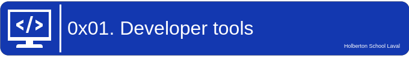

<p align="center">
    
</p>

# Learning Objectives

* What Developer Tools in your browser are
* How to open the Developer Tools on Chrome, Firefox, Safari, and Edge.
* How to use the elements tab to edit HTML and CSS
* How to audit a page according to the tips suggested by Lighthouse
* How to create and run snippets on a page
* How to get information about files and server configurations
* How to block requests
* How to know how much JavaScript or CSS is used on a page
* How to detect 404 issues
* How to move elements on a webpage

# Requirements

* A README.md file, at the root of the folder of the project, is mandatory
* Use the newest version of Google Chrome browser (78.0.3904.70 or later).
* Screenshots can be taken via the OS, not necessary via the DevTools. These screenshots are used to see how and where you are doing/playing with the DevTools.

# Tasks

#### 0. Responsive device
Go to https://dev-tools.hbtn.info/

Take a screenshot of the website using the device toolbar Choose iPhone X and show the size in your screenshot (selected device or size in pixel of the rendering)

#### 1. Change the background color

Go to https://dev-tools.hbtn.info/

Change the background-color of the body to use #4233bd Take a screenshot of the PORTFOLIO section

#### 2. Force element state
Go to https://dev-tools.hbtn.info/

Force the hover state of the “cake” block in the section Portfolio Take a screenshot of it

#### 3. Copy all the styles of the button
Go to https://dev-tools.hbtn.info/

Select the Download me! and copy all the CSS styling that is applied on this button.

Your answer file must contain all CSS styling one per line like this example:
```css
$ head -2 3-button_styles
border-radius: 1px;
color: #FF00FF;
$
```

#### 4. Change button styles
Go to https://dev-tools.hbtn.info/

* All primary buttons (btn-primary) should have the #0080ee color as a background color
* All outlined buttons light (btn-outline-light) should have #0020aa for the text color
* Screenshot all buttons that changed and merge it to one image

#### 5. Remove part of the website
Go to https://dev-tools.hbtn.info/

Remove the div of the “cake” box in the section Portfolio

Take a screenshot of it

#### 6. Where is it coming from?
Go to https://dev-tools.hbtn.info/

* On the right panel, click on the Computed tab
* Then, select the h2 with the text ABOUT
* Search for margin-bottom

Which file is coming from that declaration?

#### 7. How many listeners
Go to https://dev-tools.hbtn.info/

How many times click events are referenced in JavaScript files?

#### 8. What is the HSL code
Go to https://dev-tools.hbtn.info/

Select the primary button “Send”

What is the equivalent value of the hexadecimal background-color, in HSL?

(format of your answer should be: hsl(<VALUES>);, example: hsl(241, 23%, 24%); following by a new line)

#### 9. The max-width of the container

Go to https://dev-tools.hbtn.info/

What is the max-width for the first .container in the section “About”? (your browser width must be between 1250px and 1440px and with a zoom at 100%)

(format of your answer should be max-width: <VALUE>;, example: max-width: 670px)

#### 10. Moving around

Go to https://dev-tools.hbtn.info/

Switch the section “About” and “Portfolio”

Take a screenshot of it

#### 11. Coverage

Go to https://dev-tools.hbtn.info/

How many bytes that freelancer.css covers?

Answer file must contain the value in Byte (example: 6144 for 6KB)


#### 12. Emulate the print version of the webpage

Go to https://dev-tools.hbtn.info/

Take a screenshot of the homepage, only emulation the CSS print version of the website.

#### 13. Using the console
Go to https://dev-tools.hbtn.info/

Select the Avatar image in the header and type $0 in the console. Enter.

What does it return?

#### 14. Write code in the console
Go to https://dev-tools.hbtn.info/

Write in the console console.log(document.title), what is returned?

#### 15. Holberton web framework
Go to https://dev-tools.hbtn.info/

Which front-end framework could we guess this page is using?

In your answer file only put the letter of the multiple choice answer from below:

* A. React JS
* B. Material Design
* C. Bootstrap
* D. Angular JS

#### 16. Homepage weight
Go to https://dev-tools.hbtn.info/

What is the total weight of the page (with all the elements)?

Take a screenshot of it

#### 17. Number of requests
Go to https://dev-tools.hbtn.info/

What is the number of requests done when accessing this page?

Take a screenshot of it

#### 18. Number of CSS files
Go to https://dev-tools.hbtn.info/

How many CSS resources are loaded on this page?

#### 19. Number of images
Go to https://dev-tools.hbtn.info/

How many image resources are loaded on this page?

#### 20. Favicon image type
Go to https://dev-tools.hbtn.info/

What is the type value of the favicon image?

#### 21. Font library
Go to https://dev-tools.hbtn.info/

Holberton School website uses a font library for their icons, which one is it?

#### 22. XHR calls
Go to https://dev-tools.hbtn.info/

What is the name of the resource that generates 1 XHR calls?

#### 23. Audits panel
Go to https://dev-tools.hbtn.info/

What is the notation for Performance (for desktop mode and no throttling - also called Lighthouse)?

Take a screenshot of it

#### 24. Static assets
Go to https://dev-tools.hbtn.info/

How many static assets need a better cache policy?

Take a screenshot of it

#### 25. Accessibility
Go to https://dev-tools.hbtn.info/

When you run an accessibility audit, what is the contrast issue?

In your answer file only put the letter of the multiple choice answer from below:

* A. Image elements do not have [alt] attributes
* B. Links do not have a discernible name
* C. Background and foreground colors do not have a sufficient contrast ratio.

#### 26. No alt
Go to https://dev-tools.hbtn.info/

Which classes are on the images that have no alt attribute?

Your answer file must contain all classes, example: .my_class.my_second if 2 classes

#### 27. Best practices
Go to https://dev-tools.hbtn.info/

Which attribute is missing on all the links with the target _blank?

In your answer file only put the letter of the multiple choice answer from below:

* A. rel="noopener"
* B. rel="noreferrer"
* C. A and B
* D. rel = "nofollow"

#### 28. SEO
Go to https://dev-tools.hbtn.info/

Which <a> links don’t have enough text description?

Take a screenshot of it

#### 29. Sources
Go to https://dev-tools.hbtn.info/

The sources panel allow you to edit files, add breakpoints to analyse your JavaScript code and create snippets.

* Create a new snippet called allcolors.js
* Copy-paste the code on that page
* Run the code
* Take a screenshot of the result in your console

#### 30. Block CSS files
Go to https://dev-tools.hbtn.info/

Block all CSS requests

Take a screenshot of it

#### 31. Application panel
Go to https://dev-tools.hbtn.info/

The application panel gives you access to the storage (cookies, sessions, cache…) and some other options as Services Workers and more recently, notifications.

What is the only key present in the session storage for this page?

#### 32. Service workers
Go to https://dev-tools.hbtn.info/

Does this page have any service workers? Yes or No

#### 33. Security
Go to https://dev-tools.hbtn.info/

The security panel allows you to make sure HTTS is properly implement on a webpage.

Which organization issued the SSL certificate for this page?

#### 34. Expiration date
Go to https://dev-tools.hbtn.info/

When does the SSL certificate expire?

Take a screenshot of it
